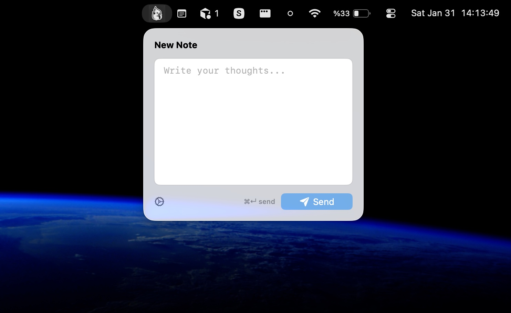
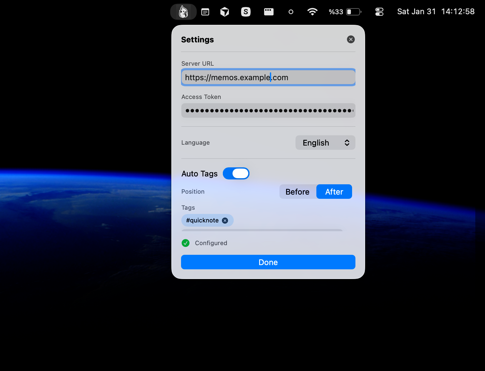

# Memos Menu Bar

A lightweight macOS menu bar client for [Memos](https://github.com/usememos/memos) - capture notes instantly without leaving your workflow.

## Screenshots

<p align="center">
  
  
</p>

## Features

- **Quick Access** - Click the menu bar icon to write notes instantly
- **Keyboard Shortcut** - Press `Cmd + Enter` to send
- **Auto-Tagging** - Automatically add tags to your memos (prepend or append)
- **Multi-Language** - English, German, Spanish, French, Turkish
- **Native macOS** - No dock icon, minimal footprint, dark mode support

## Requirements

- macOS 13.0+
- A running [Memos](https://github.com/usememos/memos) server

## Installation

### Using Xcode

```bash
cd MemosMenuBar
open Package.swift
# Run with Cmd + R
```

### Using Build Script

```bash
./build.sh
open MemosMenuBar.app
```

## Setup

1. Launch the app - settings open automatically
2. Enter your Memos server URL (e.g., `https://memos.example.com`)
3. Enter your access token (get it from Memos: Settings > My Account > Access Tokens)
4. Click Done

## Usage

1. Click the note icon in menu bar
2. Write your memo
3. Press `Cmd + Enter` or click Send

## License

MIT
